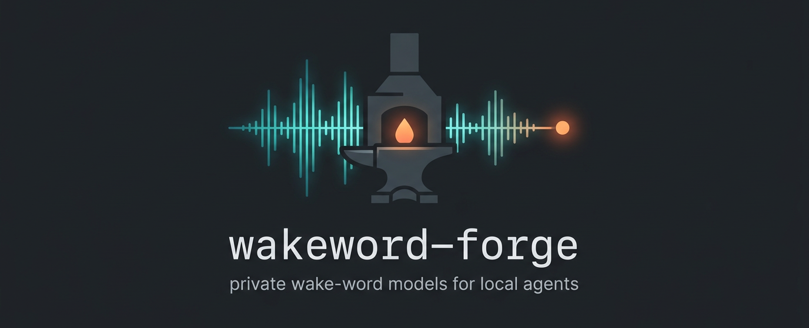
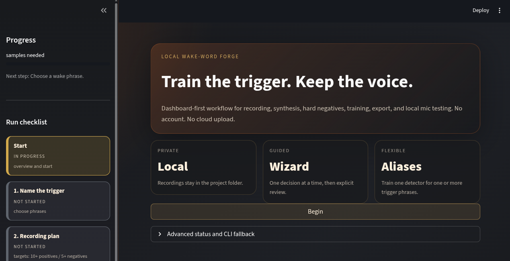
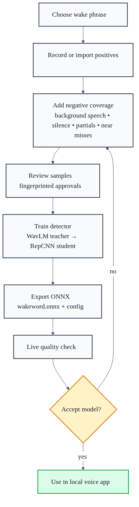

# wakeword-forge

<p align="center">
  
</p>

<p align="center">
  <strong>Train your own wake word, locally, and ship it as a ~220 KB ONNX file.</strong>
</p>

<p align="center">
  <a href="#what-you-get">What you get</a> ·
  <a href="#technical-highlights">Technical highlights</a> ·
  <a href="#privacy-and-consent">Privacy</a> ·
  <a href="#use-the-exported-model">Use the model</a> ·
  <a href="#related-projects">Related projects</a> ·
  <a href="docs/advanced-usage.md">Advanced docs</a>
</p>

`wakeword-forge` trains a custom wake-word detector for a phrase you choose (`Hey Nova`, `Okay Atlas`, anything). You collect local audio, review positives and hard negatives, train a WavLM teacher, distill it into a compact RepCNN student, and export `wakeword.onnx`.

Audio is local by default. The project is for building a custom detector, not just selecting from a fixed pretrained vocabulary.

## Quickstart

Requires Git, Python 3.10+, `make`, and a microphone. Run commands from the repo root; Make targets create/use the repo-local `.venv`. Certain functionalities require working CUDA/CuDNN drivers.

```bash
git clone https://github.com/H-Ali13381/wakeword-forge.git
cd wakeword-forge
make start DIR=~/wakeword-forge-demo
```

`DIR` is your local wake-word project folder. It will contain `samples/`, `output/wakeword.onnx`, and `output/config.json`.

Terminal-only: `make cli-run DIR=~/wakeword-forge-demo`

<p align="center">
  
</p>

The dashboard guides you through:

1. Choose a wake phrase.
2. Record or import positive samples.
3. Add background, silence, partial phrases, and near-misses.
4. Review real and generated clips.
5. Train the WavLM teacher and compact RepCNN student.
6. Export `output/wakeword.onnx`.
7. Run a live mic check before accepting the model.

## What you get

A reproducible local pipeline that goes from your voice to a deployable runtime artifact:

| Metric | Value |
| --- | --- |
| Teacher (training-only) | WavLM-base, 94.4 M params |
| Student (export) | RepCNN, ~40 K params after reparameterization |
| Exported model size | **217 KB** ONNX file |
| Inference latency | **~15 ms** per 3 s clip on CPU |
| Audio frontend | 16 kHz mono, 40-mel log-mel, 25 ms / 10 ms |
| FAR operating point | 1 % false-accept budget, threshold + EER stored in `config.json` |
| Minimum data to train | 10 positives, 5 negatives, 150 background, 100 partials (multi-word) |

The 94 M-parameter teacher is discarded after distillation. The 40 K-parameter student ships.

Public cross-speaker benchmark sweeps are not published yet; see [Limitations](#limitations).

## Technical highlights

- **End-to-end ML pipeline:** guided data collection, review gates, training, export, live validation, and model acceptance.
- **Teacher-student design:** WavLM-base is used only during training; a ~40 K-param RepCNN ships as ONNX.
- **Trust boundaries:** local-first storage, provenance docs, consent rules, and fingerprinted approvals.
- **Deployment focus:** exported ONNX model plus threshold/config metadata for app integration.
- **False-positive discipline:** background, silence, partial phrases, and near-misses are required training data, not afterthoughts.

## Why use it

Alternative open-source wake-word solutions ship pretrained models for a fixed vocabulary. `wakeword-forge` is for the case where you need to **build** the model:

- **Your phrase, your voice.** Record `Hey Nova` from your own mic, or import existing audio.
- **Local-first.** Samples and training stay on your machine. Nothing uploaded by default.
- **Review gates.** Samples, generated clips, live checks, and final acceptance are explicit, fingerprinted approvals.
- **Hard negatives are a first-class input.** Background speech, silence, partial phrases, and near-misses get their own training surface.
- **2350× parameter reduction.** A 94 M-param WavLM teacher distills into a 40 K-param RepCNN student exported as a single 217 KB `wakeword.onnx`.

## How it works



The dashboard enforces the order. Each review gate is fingerprinted against the underlying audio — if you change samples, prior approvals invalidate.

## Privacy and consent

- Audio stays under the project directory you pass as `DIR`; it is not uploaded by default.
- Treat voice clips as personal data.
- Only record, import, publish, or contribute voices when the speaker consent and license allow it.
- Generated, TTS, or voice-clone clips must be reviewed before use.
- See [DATA_PROVENANCE.md](DATA_PROVENANCE.md) and [SECURITY.md](SECURITY.md) before sharing datasets or trained models.

## Use the exported model

After `make train`, your project directory has:

- `output/wakeword.onnx` — RepCNN detector, input `waveform` (float32, 16 kHz mono, up to 3 s), output `score` (0–1)
- `output/config.json` — threshold, sample rate (16000), mel settings (40 mel, 25 ms / 10 ms), EER

Run it with onnxruntime:

```python
import json, numpy as np, onnxruntime as ort

cfg = json.load(open("output/config.json"))
sess = ort.InferenceSession("output/wakeword.onnx")
# audio_16khz_f32: mono float32 NumPy array, resampled to 16 kHz, up to 3 seconds
score = sess.run(None, {"waveform": audio_16khz_f32[None, :]})[0]
if score.item() > cfg["threshold"]:
    print("wake!")
```

Or test it on your mic: `make mic-test DIR=~/wakeword-forge-demo`

## Common commands

### Start

| Task | Command |
| --- | --- |
| Open dashboard | `make start DIR=~/wakeword-forge-demo` |
| Terminal wizard | `make cli-run DIR=~/wakeword-forge-demo` |
| Show status | `make info DIR=~/wakeword-forge-demo` |

### Collect and review

| Task | Command |
| --- | --- |
| Record positives | `make record DIR=~/wakeword-forge-demo PHRASE='Hey Nova' N=20` |
| Generate TTS positives | `make synth DIR=~/wakeword-forge-demo PHRASE='Hey Nova' N=300` |
| Import background negatives | `make import-negatives DIR=~/wakeword-forge-demo NEG_SOURCE_DIR=~/clips NEG_LIMIT=150` |
| Review samples | `make review DIR=~/wakeword-forge-demo` |
| Audit generated clips | `make audit DIR=~/wakeword-forge-demo` |

### Train and use

| Task | Command |
| --- | --- |
| Train and export ONNX | `make train DIR=~/wakeword-forge-demo` |
| Live quality check | `make quality-check DIR=~/wakeword-forge-demo` |
| Accept the model | `make accept-model DIR=~/wakeword-forge-demo` |
| Test accepted model on mic input | `make mic-test DIR=~/wakeword-forge-demo` |

Full reference, negative imports, synthesis backends, and voice-clone staging are in **[docs/advanced-usage.md](docs/advanced-usage.md)**.

## Documentation

- [docs/advanced-usage.md](docs/advanced-usage.md) — full commands, negative imports, synthesis, training output
- [docs/architecture.md](docs/architecture.md) — review gates, fingerprinting, ONNX export
- [DATA_PROVENANCE.md](DATA_PROVENANCE.md) — consent rules and data sources
- [SECURITY.md](SECURITY.md) — handling private audio
- [CONTRIBUTING.md](CONTRIBUTING.md) · [THIRD_PARTY_NOTICES.md](THIRD_PARTY_NOTICES.md) · [SUPPORT.md](SUPPORT.md)

## Related projects

- [okay-hermes-repcnn-onnx](https://github.com/H-Ali13381/okay-hermes-repcnn-onnx) — example ONNX model output for a Hermes wake phrase, packaged as a small model-card repository.
- [okay-hermes-voice](https://github.com/H-Ali13381/okay-hermes-voice) — example runtime implementation: an always-on local voice daemon that gates Hermes Agent voice interactions behind an ONNX wake-word detector.

## Limitations

- Single-speaker training generalizes weakly to other speakers, mics, and rooms.
- Benchmark numbers (EER, FAR/FRR sweeps across speakers) are not yet published.
- TTS voices and datasets carry their own license terms — see [DATA_PROVENANCE.md](DATA_PROVENANCE.md).

## License

Apache-2.0. See [LICENSE](LICENSE), [NOTICE](NOTICE), and [CITATION.cff](CITATION.cff).

Created and maintained by Hasan Ali. See [CONTRIBUTING.md](CONTRIBUTING.md) for project workflow and support expectations.
