# wakeword-forge architecture

Readable public v0.1 overview: dashboard/CLI guided collection, fingerprinted human review gates, local sample folders, DS-CNN training, ONNX export, model acceptance, and release hygiene.

```mermaid
%%{init: {"theme":"base", "flowchart":{"curve":"basis","nodeSpacing":55,"rankSpacing":80,"padding":20,"htmlLabels":true}, "themeVariables":{"background":"#ffffff","primaryColor":"#ffffff","primaryTextColor":"#111827","primaryBorderColor":"#111827","lineColor":"#374151","fontFamily":"Arial, sans-serif","fontSize":"22px","clusterBkg":"#f8fafc","clusterBorder":"#cbd5e1","edgeLabelBackground":"#ffffff"}}}%%
flowchart LR
    U([User])

    UI["Dashboard or CLI<br/><b>choose phrase</b><br/>record • synth • review"]
    DATA["Local project data<br/><b>forge_config.json + samples/</b><br/>positives • negatives • generated clips"]
    REVIEW["Human review gates<br/><b>review-samples + audit-generated</b><br/>fingerprinted approvals"]
    TRAIN["Train/export<br/><b>run_training → DSCNNTrainer</b><br/>log-mel DS-CNN • ONNX"]
    QC["Live quality gate<br/><b>quality-check</b><br/>hits • false triggers • score range"]
    ACCEPT["Acceptance gate<br/><b>accept-model</b><br/>approval bound to model hash"]
    OUT["Runtime artifacts<br/><b>wakeword.onnx</b><br/>config.json • threshold • metadata"]
    USE["Use it<br/><b>local voice app</b><br/>live mic test / embedded runtime"]
    QA["Release hygiene<br/><b>make check</b><br/>pytest • ruff • public scan"]

    U --> UI --> DATA --> REVIEW --> TRAIN --> QC --> ACCEPT --> OUT --> USE
    REVIEW -. stale if WAVs change .-> DATA
    QC -. stale if model changes .-> OUT
    ACCEPT -. finalizes current hash .-> OUT
    QA -. verifies .-> UI
    QA -. verifies .-> REVIEW
    QA -. verifies .-> TRAIN
    QA -. documents .-> OUT

    classDef user fill:#111827,stroke:#111827,color:#ffffff,stroke-width:2px
    classDef interface fill:#dbeafe,stroke:#2563eb,color:#111827,stroke-width:2px
    classDef data fill:#fef3c7,stroke:#d97706,color:#111827,stroke-width:2px
    classDef gate fill:#fee2e2,stroke:#dc2626,color:#111827,stroke-width:2px
    classDef train fill:#dcfce7,stroke:#16a34a,color:#111827,stroke-width:2px
    classDef output fill:#ede9fe,stroke:#7c3aed,color:#111827,stroke-width:2px
    classDef verify fill:#f1f5f9,stroke:#64748b,color:#111827,stroke-width:2px

    class U user
    class UI interface
    class DATA data
    class REVIEW,QC,ACCEPT gate
    class TRAIN train
    class OUT,USE output
    class QA verify
```

